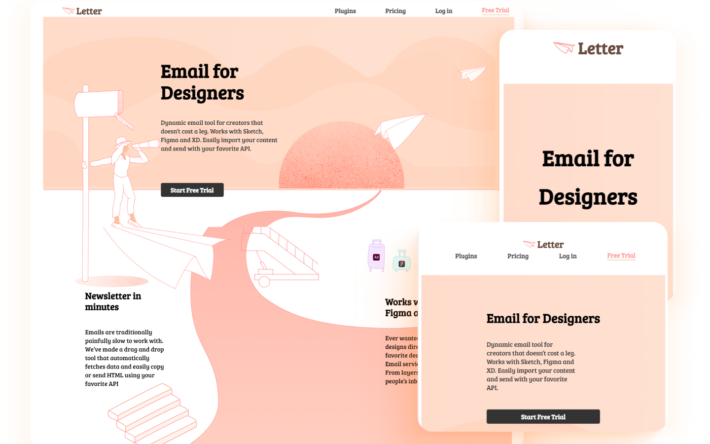

# emdeg

Simple web UI built using Next JS and styled with SCSS and it uses Next JS's component level styling. This app uses grids and flexbox to build layouts. It's adaptive as well as reponsive across multiple devices.

## Web UI snapshots designed using Figma

